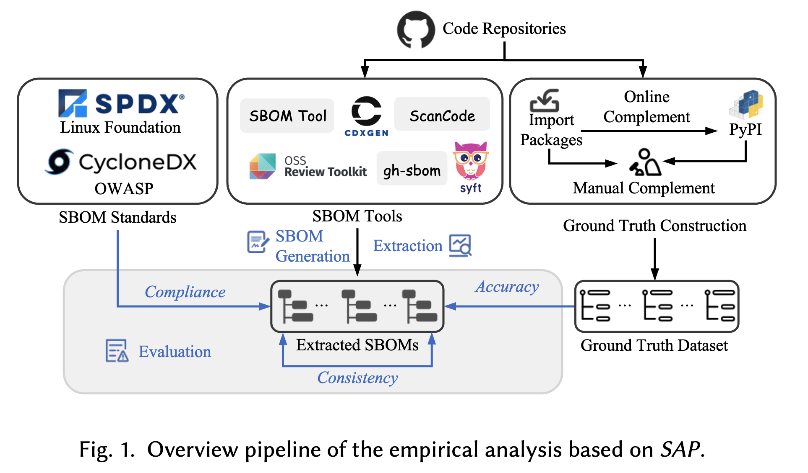
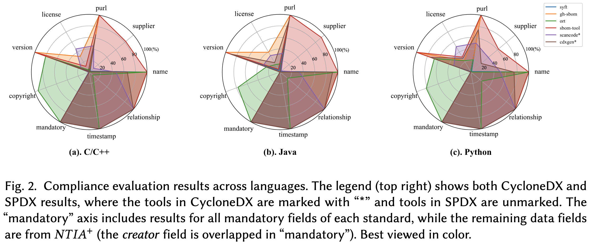
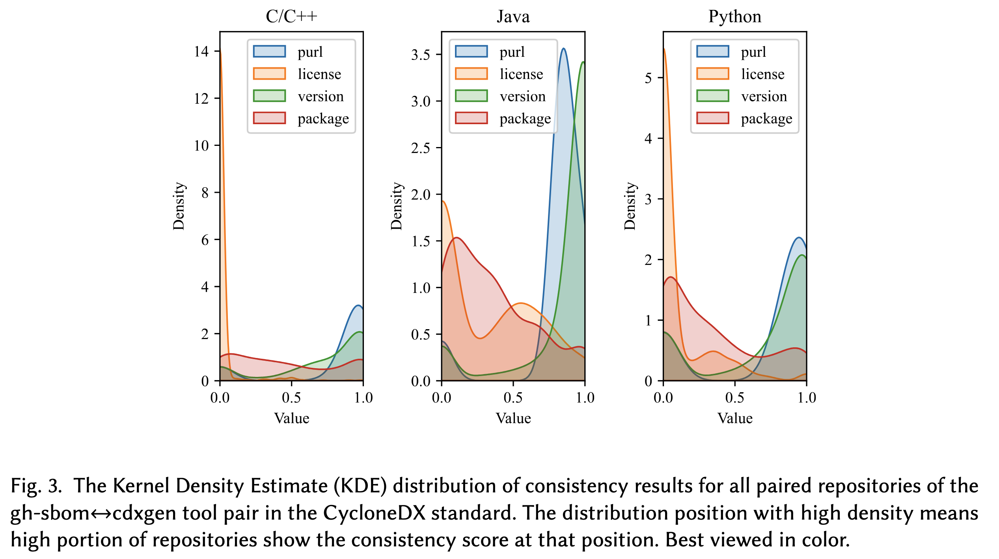
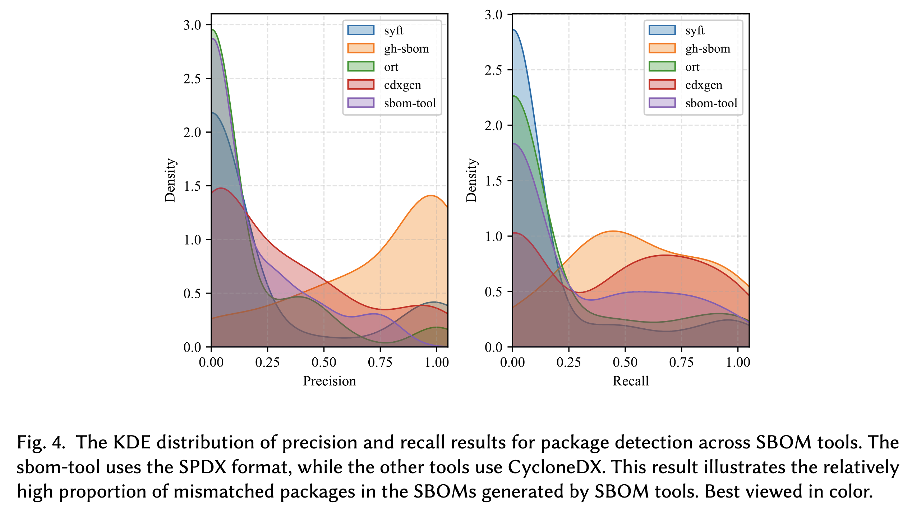

# SAP: A Large Scale Empirical Analysis on the Adherence Gap between Standards and Tools in SBOM

🌟 News: Our paper has been accepted by the ACM Transactions on Software Engineering and Methodology (TOSEM)!

 [ArXiv](https://arxiv.org/abs/2601.05622) | [Dataset](https://zenodo.org/records/14998624) | [Code](https://github.com/dw763j/SAP)

This is the open source repository for our paper "A Large Scale Empirical Analysis on the Adherence Gap between Standards and Tools in SBOM".

## Introduction

A Software Bill of Materials (SBOM) is a machine-readable artifact that systematically organizes software information, enhancing supply chain transparency and security. To facilitate the exchange and utilization of SBOMs, organizations such as the Linux Foundation and OWASP have proposed SBOM standards. Following standards, organizations have developed tools for generating and utilizing SBOMs. However, limited research has examined the adherence of these SBOM tools to standard specifications, a gap that could lead to compliance failures and disruptions in SBOM utilization.
This paper presents the first large-scale, two-stage empirical analysis of the adherence gap, using our automated evaluation framework, SAP. The evaluation, comprising a baseline evaluation and a one-year longitudinal follow-up, covers 55,444 SBOMs generated by six SBOM tools from 3,287 real-world repositories. Our analysis reveals persistent, fundamental limitations in current SBOM tools: (1) inadequate compliance support with policy requirements; (2) poor tool consistencies, including inter-tool consistency rates as low as 7.84\% to 12.77\% for package detection across languages, and significant longitudinal inconsistency, where tools show low consistency with their own prior versions; and (3) mediocre to poor accuracy for detailed software information, *e.g.*, accuracy of package licenses below 20\%. We analyze the root causes of these gaps and provide practical solutions.



## Dataset

We release all the 27,795 generated SBOMs by the six tools at Zenodo: [https://zenodo.org/records/14998624](https://zenodo.org/records/14998624).
The Zenodo link also includes fast check code and related test SBOMs.

## Usage

All the results in paper are in the `results` folder. 

### Docker image for generating SBOMs yourself
We upload the replication docker image that contains all the installed environments of the SBOM tools anonymously at [https://hub.docker.com/r/d32s3a/anonymous-opensource](https://hub.docker.com/r/d32s3a/anonymous-opensource), you can get it by the following command:

```bash
docker pull d32s3a/anonymous-opensource:1.0
```

Use `conda env list` to see all the environments of SBOM tools. The `ort` is at `/all-sbom-tools/ort-35.0.0/ort/cli/build/install/ort/bin/ort`(name with 35.0.0 but it is 36.0.0 as described in paper). The other tools can run directly with its name in their corresponding conda envs. 
All the scripts in SAP for SBOM generation locate at `run-sbom-tools` folder. These scripts need to run in the docker except `cdxgen` that need to interact with docker thus runs on host.

## Run the code

### For fast check on test SBOMs

We provide a small dataset in the test-sboms folder for you to test the code.

We provide a all-in-one script to run the code for evaluating the adherence gap of SBOM tools and SBOM standards. You can run the following command to run the code on the test-sboms dataset:

```bash
git clone https://github.com/dw763j/SAP.git
cd SAP
uv venv
source .venv/bin/activate
uv pip install -r requirements.txt
python test-run.py
```

As the test sboms are just 42 randomly selected repositories from Python part of the $D_{repo}$, the results are different from our paper but still can check our code. If you want to run the code on all the SBOMs, see next part.

### Run on all SBOMs
If you want to rerun the whole process of SAP on all SBOMs, download and unzip the all-sboms.zip(around 50GB after unzip) at [https://zenodo.org/records/14998624](https://zenodo.org/records/14998624), and change the `dir` in test-run.py and rerun again(possible clean up of the result dir is needed).

The results of the `test-run.py` will be in the `test-sbom-results` folder.


## More details
The results in paper are as follows:

### Compliance




#### C/C++
| tool      | name    | supplier | purl    | license | version | copyrightText | dependency relationship |
| --------- | ------- | -------- | ------- | ------- | ------- | ------------- | ----------------------- |
| syft      | 100.00% | 2.28%    | 48.19%  | 0.99%   | 48.95%  | 0.00%         | 100.00%                 |
| gh-sbom   | 100.00% | 0.00%    | 100.00% | 31.21%  | 100.00% | 7.93%         | 100.00%                 |
| ort       | 100.00% | 0.00%    | 5.48%   | 4.87%   | 80.07%  | 93.97%        | 8.10%                   |
| sbom-tool | 100.00% | 82.47%   | 99.97%  | 11.49%  | 99.97%  | 0.00%         | 100.00%                 |
| scancode* | 46.28%  | 9.89%    | 46.28%  | 46.28%  | 14.33%  | 1.02%         | 100.00%                 |
| cdxgen*   | 65.94%  | 1.44%    | 65.95%  | 2.64%   | 65.95%  | 0.00%         | 100.00%                 |


#### Java

| tool      | name    | supplier | purl    | license | version | copyrightText | dependency relationship |
| --------- | ------- | -------- | ------- | ------- | ------- | ------------- | ----------------------- |
| syft      | 100.00% | 1.76%    | 65.74%  | 3.08%   | 65.80%  | 0.00%         | 100.00%                 |
| gh-sbom   | 100.00% | 0.00%    | 100.00% | 39.65%  | 100.00% | 9.10%         | 100.00%                 |
| ort       | 100.00% | 0.00%    | 14.88%  | 15.02%  | 25.41%  | 77.29%        | 16.59%                  |
| sbom-tool | 100.00% | 93.27%   | 100.00% | 5.43%   | 100.00% | 0.00%         | 100.00%                 |
| scancode* | 33.06%  | 2.94%    | 33.06%  | 33.06%  | 31.54%  | 0.01%         | 100.00%                 |
| cdxgen*   | 90.87%  | 0.03%    | 90.87%  | 18.76%  | 90.87%  | 0.00%         | 100.00%                 |


#### Python

| tool      | name    | supplier | purl   | license | version | copyrightText | dependency relationship |
| --------- | ------- | -------- | ------ | ------- | ------- | ------------- | ----------------------- |
| syft      | 100.00% | 1.62%    | 42.64% | 0.95%   | 42.78%  | 0.00%         | 100.00%                 |
| gh-sbom   | 100.00% | 0.00%    | 67.87% | 23.15%  | 100.00% | 0.00%         | 100.00%                 |
| ort       | 100.00% | 0.00%    | 21.42% | 22.91%  | 67.49%  | 82.13%        | 24.40%                  |
| sbom-tool | 100.00% | 62.06%   | 99.96% | 30.05%  | 99.96%  | 0.00%         | 100.00%                 |
| scancode* | 50.86%  | 39.24%   | 50.86% | 50.86%  | 31.40%  | 0.38%         | 100.00%                 |
| cdxgen*   | 74.60%  | 23.18%   | 74.60% | 27.54%  | 74.60%  | 0.00%         | 100.00%                 |

### Consistency



| tools             | package | version | purl   | license | package | version | purl   | license | package | version | purl   | license |
| ----------------- | ------- | ------- | ------ | ------- | ------- | ------- | ------ | ------- | ------- | ------- | ------ | ------- |
| syft+gh-sbom      | 9.15%   | 19.13%  | 19.41% | 0.09%   | 45.29%  | 60.84%  | 72.55% | 0.33%   | 23.87%  | 43.92%  | 44.15% | 0.13%   |
| syft+ort          | 1.21%   | 3.08%   | 2.87%  | 0.00%   | 5.94%   | 14.51%  | 14.49% | 0.12%   | 3.05%   | 6.46%   | 6.14%  | 0.00%   |
| syft+scancode     | 0.41%   | 4.89%   | 5.44%  | 0.95%   | 3.02%   | 16.67%  | 16.91% | 0.60%   | 0.42%   | 2.50%   | 2.65%  | 0.77%   |
| syft+cdxgen       | 12.05%  | 28.48%  | 23.31% | 0.11%   | 63.90%  | 85.73%  | 71.99% | 0.32%   | 17.24%  | 34.97%  | 34.54% | 0.19%   |
| gh-sbom+ort       | 3.54%   | 9.28%   | 8.89%  | 1.71%   | 18.32%  | 56.64%  | 57.49% | 30.77%  | 9.69%   | 19.19%  | 20.54% | 3.90%   |
| gh-sbom+scancode  | 0.18%   | 3.07%   | 3.00%  | 0.35%   | 2.42%   | 28.65%  | 29.89% | 0.57%   | 0.17%   | 1.23%   | 2.24%  | 0.34%   |
| gh-sbom+cdxgen    | 45.79%  | 72.60%  | 82.12% | 1.74%   | 34.74%  | 86.54%  | 80.67% | 29.97%  | 32.83%  | 70.10%  | 72.85% | 9.22%   |
| ort+scancode      | 0.09%   | 0.35%   | 0.32%  | 0.14%   | 0.03%   | 0.65%   | 0.72%  | 0.16%   | 0.01%   | 0.12%   | 0.12%  | 0.00%   |
| ort+cdxgen        | 2.98%   | 5.79%   | 5.52%  | 0.26%   | 11.39%  | 14.34%  | 12.02% | 6.11%   | 14.88%  | 24.57%  | 24.30% | 2.93%   |
| scancode+cdxgen   | 0.33%   | 4.61%   | 4.44%  | 0.66%   | 1.66%   | 15.62%  | 13.35% | 3.73%   | 0.29%   | 2.95%   | 3.30%  | 0.50%   |
| syft+gh-sbom      | 32.41%  | 41.98%  | 46.08% | 0.00%   | 7.98%   | 16.75%  | 18.36% | 0.00%   | 28.23%  | 45.84%  | 45.68% | 0.00%   |
| syft+ort          | 0.44%   | 2.86%   | 2.85%  | 0.00%   | 2.42%   | 14.34%  | 14.21% | 0.01%   | 1.13%   | 6.16%   | 6.20%  | 0.00%   |
| syft+sbom-tool    | 7.27%   | 12.85%  | 12.80% | 0.00%   | 3.36%   | 5.65%   | 5.62%  | 0.00%   | 9.58%   | 22.01%  | 22.38% | 0.00%   |
| gh-sbom+ort       | 0.39%   | 2.91%   | 3.11%  | 0.00%   | 0.09%   | 0.57%   | 0.57%  | 0.00%   | 0.88%   | 5.19%   | 5.30%  | 0.00%   |
| gh-sbom+sbom-tool | 6.51%   | 12.77%  | 13.23% | 8.51%   | 3.07%   | 5.42%   | 5.58%  | 4.33%   | 8.55%   | 21.75%  | 22.26% | 18.24%  |
| ort+sbom-tool     | 2.70%   | 5.42%   | 5.44%  | 0.00%   | 0.64%   | 1.01%   | 1.01%  | 0.00%   | 10.56%  | 15.18%  | 17.02% | 0.00%   |
| average           | 7.84%   | 14.38%  | 14.93% | 0.91%   | 12.77%  | 26.50%  | 25.96% | 4.81%   | 10.09%  | 20.13%  | 20.60% | 2.26%   |


### Accuracy



| tool      | count | precision | recall | supplier | license | version |
| --------- | ----- | --------- | ------ | -------- | ------- | ------- |
| syft      | 100   | 17.69%    | 12.39% | 0.00%    | 0.00%   | 18.00%  |
| gh-sbom   | 36    | 73.84%    | 58.50% | 0.00%    | 8.72%   | 64.30%  |
| ort       | 84    | 12.01%    | 16.90% | 0.00%    | 13.95%  | 5.95%   |
| scancode  | 199   | 0.00%     | 0.00%  | 0.00%    | 0.00%   | 0.00%   |
| cdxgen    | 98    | 29.78%    | 42.96% | 18.15%   | 14.76%  | 15.31%  |
| sbom-tool | 100   | 14.50%    | 24.38% | 9.69%    | 18.49%  | 11.07%  |
